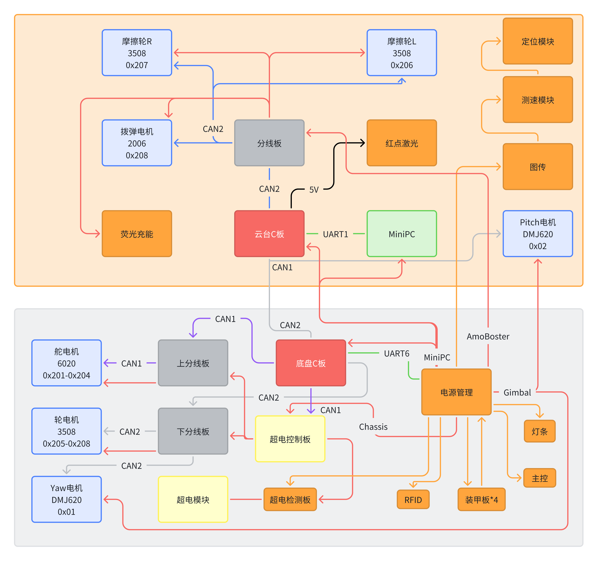

# 系统架构

## 控制方式

[操作手册(飞书)](https://g6ursaxeei.feishu.cn/wiki/UhxvwTFOYiSJyukzoGEcKsWmnQe?from=from_copylink)

## CAN总线id

设备名 | ID | RX反馈报文标识符 | TX控制报文标识符 | 电机类型
-|-|-|-|-
舵电机 | 1~4 | 0x205~0x208 | 0x1FF[01,23,45,67] | GM6020
轮电机 | 1~4 | 0x201~0x204 | 0x200[01,23,45,67] | M3508(C620)
YAW电机 | * | 0x01 | 0x11 | 达妙
底盘板 | * | 0x101 | 0x102 | *
云台版 | * | 0x102 | 0x101 | *
PITCH电机 | 1 | 0x02 | 0x12 | 达妙
摩擦轮L | 6 | 0x206 | 0x1FF[23] | M3508(C620)
摩擦轮R | 7 | 0x207 | 0x1FF[45] | M3508(C620)
拨弹电机 |8 | 0x208 | 0x1FF[67] | M2006(C610)

## 结构图

## 滑环

CAN*2

航插*4

miniPC_power*2

gimbal_power*2

ammo_boster*2
