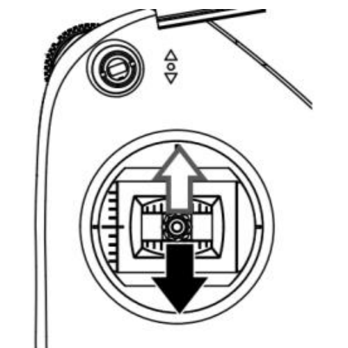
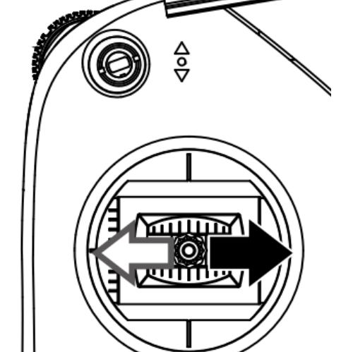
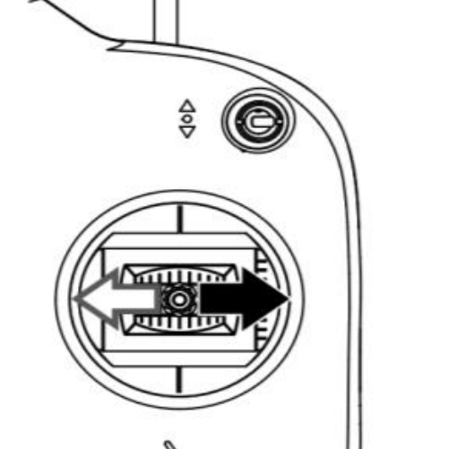

**Operation Manual of Standard**

# 步兵操作手册 小珍珠(旧版，新版详见飞书)

## 遥控器控制

| 遥控器操作 | 指令| 说明  |
| - | - | - |
|  |  | 向上推杆，机器人云台上仰（+）； 向下推杆，机器人云台下俯（-）. |
|  |  | 向左推杆，云台逆时针旋转； 向右推杆，云台顺时针旋转； 中位时，机器人保持静止.  随动模式下底盘将保持跟随云台. |
|  |  | 向上推杆，机器人前进； 向下推杆，机器人后退； 中位时，机器人保持静止. |
|  |  | 向左推杆，机器人平行左移； 向右推杆，机器人平行右移； 中位时，机器人保持静止。 |
|  |  | S1 位置-1：分离模式； 位置-2：随动模式； 位置-3：陀螺模式 |
|  |  | S2 位置-1：手动发弹模式； 位置-2：保险模式； 位置-3：自动发弹模式 |
|  |  | 手动发弹模式，下拨单发，下拨并维持连发； 自动发弹模式，上拨单发，下拨自动发弹； 保险模式，无效 |

## 键鼠控制

### 动作相关

| 键位 | 功能 |
| - | - |
| W | 前进 |
| A | 左移 |
| S | 后退 |
| D | 右移 |
| Q | 进入陀螺 |
| E | 进入随动 |
| R | 刷新ui |
| X | 回头(云台旋转180°) |
| SHIFT(长按) | 使用超电 |

### 射击相关

| 键位 | 功能 |
| - | - |
| 左键 | 射击 (点射，长按超过150ms连射) |
| 右键 (长按) | 一般模式：瞄准 (手动发弹) 打符模式：自动发弹 |
| C | 进入大符模式 (手动发弹) |
| V | 进入小符模式 (手动发弹) |
| Z | 一般模式下瞄准并自动发弹（无需按右键） |

### 客户端相关

| 键位 | 功能 |
| - | - |
| Tab | 打开状态面板 |
| ~ | 受伤害统计，模块状态 |
| P | 设置面板 |
| O | 补弹面板 |

## 注意事项

- 超电剩余容量大于40%时允许开启超电，小于15%时强制关闭，直至余量再次大于40%时可以再次开启
- 请勿在开超电前进时进行回头操作，可能导致翻车
